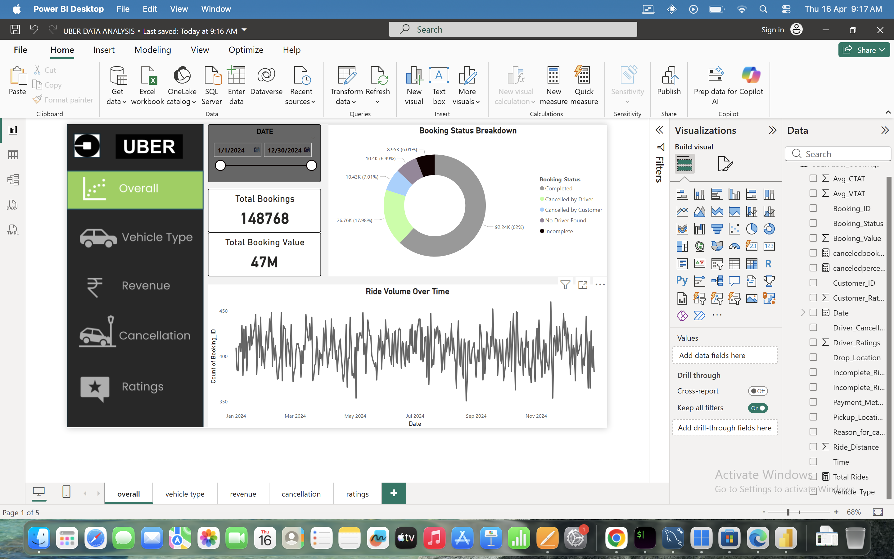

# uber-data-analysis-project-excel-mysql-powerbi
# 🚖 Uber Data Analysis Project

## 📌 Objective

The objective of this project is to analyze Uber ride data to identify key patterns, peak booking hours, customer behavior, and business insights that can help improve operational efficiency and revenue.

---

## 🛠 Tools Used

* SQL (Data Analysis)
* Power BI (Dashboard Visualization)
* Excel/Spreadsheet (Data Cleaning)

---

## 🧹 Data Cleaning(EXCEL/SPREADSHEET)

Before performing analysis, the dataset was cleaned to ensure accuracy and consistency.

* Removed duplicate booking_id records.
* Applied TRIM() and CLEAN() to remove hidden spaces.
* Standardized column names to snake_case format.
* Corrected data types (Date, Decimal, Text).
* Validated row counts using COUNT(*) vs COUNT(DISTINCT booking_id).
* Handled NULL values in operational columns (avg_ctat, v_tat).

# Final dataset contains 148,767 unique bookings with no duplicate IDs.

---

## 🗄 Data Analysis (SQL)

Performed various SQL queries to extract meaningful insights:

 * Retrieve all successful bookings:
 * Find the average ride distance for each vehicle type: 
 * Get the total number of cancelled rides by customers: 
 * List the top 5 Pickup locations with the highest number of rides:
 * Get the number of rides cancelled by drivers due to personal and car-related issues:
 * Find the maximum and minimum driver ratings for Prime Sedan bookings: 
 * Retrieve all rides where payment was made using UPI: 
 * Find the average customer rating per vehicle type: 
 * Calculate the total booking value of rides completed successfully: 
 * List all incomplete rides along with the reason:

---

## 📊 Dashboard (Power BI)

Developed an interactive dashboard to visualize insights:

* Ride Volume Over Time 
* Booking Status Breakdown 
* Top 5 Vehicle Types by Ride Distance 
* Average Customer Ratings by Vehicle Type 
* cancelled Rides Reasons 
* Revenue by Payment Method 
* Top 5 pickup locations by Total Booking Value 
* Ride Distance Distribution Per Day
* Driver Ratings Distribution
* Customer vs. Driver Ratings

---

## 📁 Project Files

* uber_data.csv → Dataset
* sql_queries.sql → SQL queries used for analysis
* powerbi_dashboard.pbix → Power BI dashboard
* README.md → Project documentation

---

## 💡 Key insights   
* Most of the company’s revenue comes from successfully completed rides.
* Different vehicle types are used for different ride distances.
* Ride cancellations by customers and drivers affect overall performance.
* A small number of customers book rides frequently and add high value to the business.
* Driver ratings vary across vehicle types, showing differences in service quality.
* UPI is a popular payment method among customers.
* Premium vehicle categories contribute a large share of total revenue.
* Incomplete rides indicate areas where improvements are needed.
   

---

## 📸 Dashboard Preview

👉 More dashboard screenshots are available in the dashboard folder.
